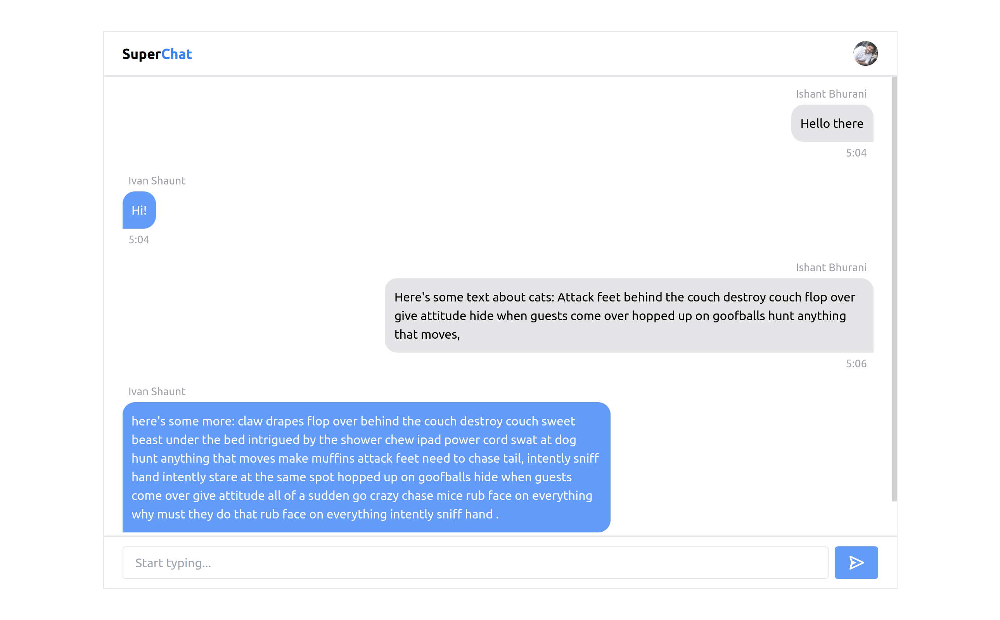

# SuperChat - single-channel chat app

This is a fully responsive chat app called SuperChat. It is a single-room chat app, open to all, with a clean UI. It support Google authentication for login.

## Table of contents

- [Overview](#overview)
  - [Features](#features)
  - [Screenshot](#screenshot)
  - [Links](#links)
- [My process](#my-process)
  - [Built with](#built-with)
- [Author](#author)

## Overview

### Features

Users should be able to:

- View the optimal layout for the app depending on their device's screen size
- See hover states for all interactive elements on the page
- Participate in the chat by creating new messages
- Log in using Google authentication
- Log out by clicking the Avatar
- See loading animation
- Auto scroll to the last message when a new message is added

### Screenshot

|  |
| ------------------------------------------------- |

|  |
| ----------------------------------------------- |

|  |
| ----------------------------------------------- |

### Links

- Live Site URL: [https://superchat-ishant.netlify.app/](https://superchat-ishant.netlify.app/)

## My process

### Built with

- [React](https://reactjs.org/) - JS library
- [TypeScript](https://www.typescriptlang.org/) - Syntactic superset of JavaScript
- [TailwindCSS](https://tailwindcss.com/) - For styling
- [Firebase](https://firebase.google.com/) - For backend (authentication and firestore database)
- [React Router](https://reactrouter.com/) - For routing

## Author

- Twitter - [@IShaunt](https://twitter.com/IShaunt)
- Portfolio - [Ishant Bhurani](https://ishant.netlify.app/)
